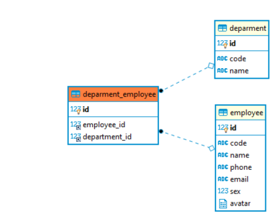

- Tạo RESTfull API với C#, và một hệ quản trị cơ sở dữ liệu quan hệ nào đó ví dụ như SQLite. Quản lý thông tin Employee, Deparment, Deparment-Employee

- Ở column Code của table Employee. Nếu param truyền vào là blank, null, thì tiến hành tạo tự động code, code sẽ tự động tăng (1) sau mỗi lần thêm mới Employee. Cấu trúc không cố định. Cấu trúc của code tự tăng sẽ phụ thuộc vào cấu trúc code của employee thêm trước đó. Có thể là:

    - 01-Emp
    - Emp-01
    - 00001-Emp
    - 1000001-Emp

- Đối với trường hợp database không có employee tạo trước đó thì mặc định tạo tự động theo cấu trúc sau : 00001-Emp